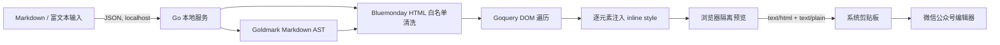

# 微信排版台（WeChat Publisher）

一个使用 Go 构建、完全在本机运行的微信公众号排版工具。支持 Markdown 与基础富文本编辑、普通文章智能分段、精彩句自动标注、主题预设和手机宽度预览，将内容转换为全内联样式 HTML，再通过浏览器剪贴板复制到微信公众号编辑器。

## 快速开始

```bash
go mod download
go run .
```

浏览器打开 <http://127.0.0.1:8787>。构建单文件程序：

```bash
go build -trimpath -ldflags="-s -w" -o wechat-publisher .
./wechat-publisher
```

静态前端通过 `go:embed` 打进可执行文件，运行时不依赖 Node.js、CDN 或云端接口。服务只监听 `127.0.0.1`。

## 架构



边界划分：

- 浏览器层：编辑、180ms 防抖预览、读取本地图片、剪贴板写入。
- Go 层：Markdown 解析、HTML 安全清洗、主题映射、全内联样式生成。
- 数据层：无数据库、无账号、无遥测，刷新页面即丢弃未保存内容。

界面采用固定视口三栏工作台：左侧为流程导航，中间为主题与全宽编辑器，右侧为识别结果、文章统计与发布操作。点击“手机预览”会打开 390px 屏幕宽度的拟真手机弹窗；手机内部的文章区域拥有独立滚动条，长文章不会撑高页面。Markdown 与富文本编辑器首次打开均为空，输入提示只使用 placeholder，不会混入文章正文。

## 智能结构识别

多行纯文本粘贴到 Markdown 或富文本编辑器时，会调用本机的 `POST /api/structure`：

- 第一行较短且不含句末标点时识别为文章标题。
- `一、`、`第一章`、`2.` 以及“为什么”“如何”等独立短行识别为一级章节。
- `（一）`、`(1)`、`1.1` 等编号短行识别为二级小节。
- `•`、`●`、`▪` 等项目符号归一化为 Markdown 列表。
- 已有 Markdown 标题、列表、引用、表格和代码围栏保持原结构。
- 其余非空行转换为独立段落，解决从网页或文档复制后正文挤成一段的问题。

右侧开关可以关闭粘贴时自动识别；“智能识别全文结构”按钮可以对当前纯文本重新整理。已有图片的富文本不会被全文重排，避免 Data URL 图片丢失。

排版阶段还会把主标题后的第一段标记为导语，并为标题、导语、一级章节、二级小节、正文和引用建立不同的字号、间距、边框与背景。四套主题具有不同的层级语言，而不只是替换颜色：经典蓝使用标题标签，优雅紫使用柔和引导线，暖橙使用实色色块，极简黑使用留白与横线分隔。

## 精彩句自动标注

渲染时会在本机为段落中的句子评分，每段默认最多标注一句，五句以上的长段落最多标注两句。当前识别依据包括：

- “不是……而是……”“真正重要的是”“本质”“关键”“意味着”等观点结构。
- “与其……不如……”“只有……才……”“越……越……”等有明确关系的表达。
- 百分比、金额、人数、年份、倍数等数字事实。
- 转折、结论、引语和简洁有力的独立短句。

观点金句使用主题色加粗，数据事实使用浅色底纹加粗，简洁洞察使用加粗下划线。算法会跳过代码、链接、图片和用户已经手动加粗的内容，避免覆盖原作者排版。这个功能是可解释的本地启发式评分，不等同于大模型语义理解；右侧开关可随时关闭。

## 核心转换流程

1. Markdown 使用 Goldmark + GFM 扩展转换为结构化 HTML；富文本直接进入清洗流程。
2. Bluemonday 删除 `script`、事件属性、`javascript:` URL 等危险输入。
3. Goquery 遍历安全 DOM，根据标签写入静态 `style` 属性。
4. 返回 HTML 片段，不返回 `<style>`、CSS 类依赖或外部脚本。
5. Clipboard API 同时写入 `text/html` 和 `text/plain`，不支持时回退到选区复制。

样式主题集中在 `main.go` 的 `theme` 函数中。增加主题只需新增颜色变量或整套标签样式映射；不要依赖复杂选择器、伪元素、CSS 变量、Flex/Grid 布局或 JavaScript，因为微信公众号编辑器可能移除它们。

## 图片策略和现实边界

- HTTPS 图片：Markdown 中直接使用 ``。
- 本地图片：富文本模式读取为 Data URL，全程不上传第三方服务。
- 微信公众号后台可能重新上传、压缩或移除外链/Data URL 图片；这是目标编辑器的策略，无法仅靠 HTML 保证。正式发布前必须在公众号后台确认每张图片已进入微信素材体系。
- 生产增强版可增加“导出 HTML + 本地图片资源包”，或通过用户自行配置的公众号素材 API 上传；后者不再属于纯本地、零凭证模式。

## 安全与隐私

- 默认只监听 loopback，不暴露到局域网。
- 请求体上限 16 MB，单张本地图片在 UI 中限制为 5 MB。
- Content Security Policy 禁止第三方脚本、对象和远程网络请求；仅图片允许 `http/https/data/blob`。
- 输入 HTML 先按白名单清洗，再注入程序生成的样式。
- 不记录文章正文，服务日志只记录启动和 HTTP 服务异常。

## 兼容性原则

微信公众号编辑器没有稳定公开的完整 HTML/CSS 支持矩阵，因此采用保守子集：语义标签、像素/相对字号、基础颜色、边框、间距与行高。复制后仍需人工检查图片、代码横向滚动、表格宽度和超长链接。不同浏览器及微信后台版本可能产生差异。

## 项目结构

```text
.
├── main.go          # 本地 HTTP 服务、转换器、主题与安全策略
├── main_test.go     # 内联样式和 XSS 清洗测试
├── go.mod
└── web/
    ├── index.html   # 双模式编辑器与预览结构
    ├── app.css      # 工具自身 UI，不进入复制结果
    └── app.js       # 防抖渲染、图片读取、Clipboard API
```

## 验证

```bash
go test ./...
go vet ./...
```

人工兼容测试应覆盖 Chrome、Safari，以及微信公众号后台中的标题、正文、引用、嵌套列表、代码块、表格、外链图和本地图。自动化测试只能证明输出结构与安全规则，不能代替微信后台真实粘贴测试。

## 后续阶段

1. 当前 MVP：Markdown/富文本、智能结构识别、精彩句自动标注、四套主题、独立滚动、图片、预览、全内联复制和 HTML 导出。
2. 编辑体验：文章草稿本地存储、撤销历史、自定义字号/间距、主题导入导出。
3. 兼容增强：基于真实微信公众号粘贴样本建立回归语料，增加 HTML 差异检查。
4. 分发：为 macOS/Windows 打包单文件程序，启动后自动打开浏览器；签名安装包另行处理。
